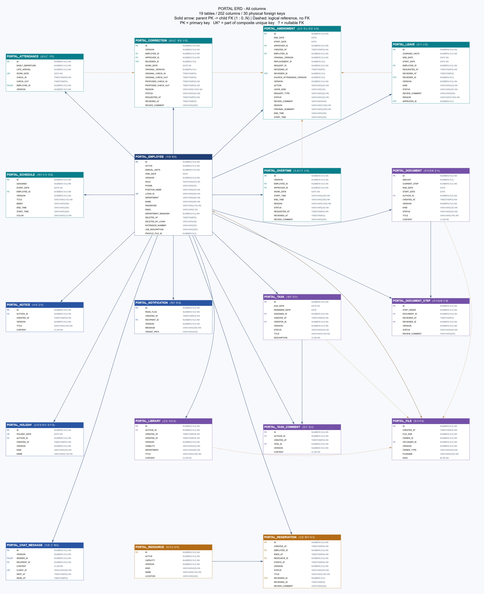

# 사내 업무 포털 Groupware
 
## 프로젝트 소개 Introduction
### 직원의 근태와 사내 업무를 한곳에서 관리하는 그룹웨어 웹 서비스
출퇴근 기록, 휴가·초과근무 신청과 승인, 업무·일정 관리, 전자결재, 자원 예약, 자료실, 직원 간 채팅 기능을 제공. 직원·부서 관리자·시스템 관리자에 따라 접근 권한도 구분
 
 
 
## 프로젝트 개발 Project Development

### 개발환경 Development Environment
- IntelliJ IDEA
- Visual Studio Code
- Apache Tomcat 9
- Docker

### 기술스택 Tech Stack
- language : Java 17, HTML · CSS · JavaScript
- Build : Maven
- Framework : Spring, Spring Boot 4.1.1
- ORM : Spring Data JPA
- DB : Oracle 11g
- Server : AWS EC2

### ERD

